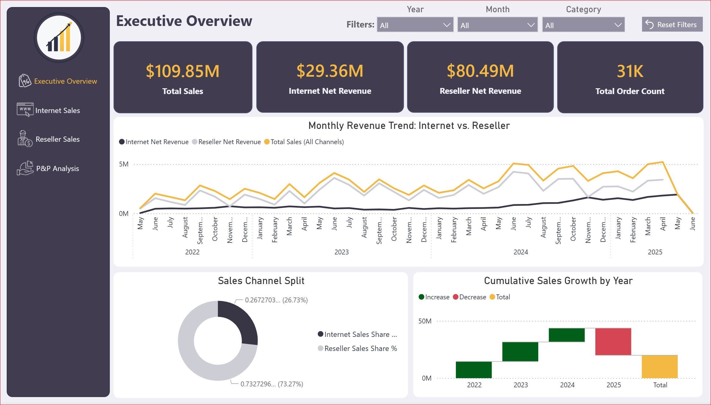

# AdventureWorks — End-to-End Data Warehouse & BI Project

An end-to-end Business Intelligence project built on the **AdventureWorks2025** OLTP sample
database, covering the full pipeline from source system analysis to an interactive dashboard —
including automated nightly refreshes:

**SQL Server (source) → SSIS (ETL, scheduled) → SQL Server Data Warehouse → SSAS Tabular (semantic model, scheduled refresh) → Power BI (reporting)**

Unlike a generic AdventureWorks walkthrough, this project designs its own Data Warehouse from
scratch (rather than using the pre-built `AdventureWorksDW` sample), with an explicit business
scenario, a documented star schema design, incremental loads, a unified Tabular semantic model,
a multi-page Power BI dashboard, automated nightly scheduling via SQL Server Agent, a query
performance review with applied indexing, and a real troubleshooting log covering ETL, DAX, and
automation issues.

## Business Scenario

AdventureWorks sales management wants a Data Warehouse that can:
- Analyze Internet Sales (direct/individual customers) and Reseller Sales (store/B2B) separately
  and comparably
- Track sales trends over time by product, territory, and customer
- Support Year-over-Year comparisons
- Update incrementally rather than via full reload

## Project Roadmap

| Phase | Description | Status |
|---|---|---|
| 0 | Source System Analysis | ✅ Done — [`docs/Phase0_Source_System_Analysis.pdf`](docs/Phase0_Source_System_Analysis.pdf) |
| 1 | Data Warehouse schema design (DDL) | ✅ Done — [`sql/`](sql/) |
| 2 | SSIS packages (ETL) | ✅ Done — [`ssis/`](ssis/) |
| 3 | Data quality & incremental load | ✅ Done — [`sql/`](sql/), [`docs/PHASE3_INCREMENTAL_LOAD_SUMMARY.md`](docs/PHASE3_INCREMENTAL_LOAD_SUMMARY.md) |
| 4 | SSAS Tabular model | ✅ Done — [`ssas/`](ssas/), [`docs/PHASE4_SSAS_TABULAR_SUMMARY.md`](docs/PHASE4_SSAS_TABULAR_SUMMARY.md) |
| 5 | Power BI dashboard | ✅ Done — [`powerbi/`](powerbi/) |
| 6 | Final documentation | ✅ Done — this README, [`docs/ARCHITECTURE.md`](docs/ARCHITECTURE.md), [`docs/screenshots/`](docs/screenshots/) |
| 7 | Automation / deployment | ✅ Done — `FullReloadMode` package parameter + a nightly SQL Server Agent job (`Job_AdventureWorks_DailyLoad`) running the SSIS load and a TMSL-based SSAS refresh |
| 8 | Performance review — execution plans & indexing on DW tables | ✅ Done — [`docs/Phase8_Performance_Review.pdf`](docs/Phase8_Performance_Review.pdf) |
| 9 | SSRS paginated report (optional) | ⏸️ Paused — in progress, on hold |

## Architecture

```
SQL Server (AdventureWorks2025, OLTP)
        │
        ▼
   SSIS ETL packages  ──►  SQL Server Data Warehouse (AdventureWorksDW_Custom)
   (incremental loads,          │  9 dimensions (8 incremental + static DimDate)
    watermark-based)            │  2 fact tables (FactInternetSales, FactResellerSales)
                                 ▼
                        SSAS Tabular semantic model
                        (conformed dimensions, DAX measures,
                         Calendar hierarchy, Perspectives)
                                 │
                                 ▼
                        Power BI Dashboard (Live Connection)
                        4 pages: Executive Overview · Internet Sales ·
                                 Reseller Sales · Product & Promotion Analysis

   SQL Server Agent (Job_AdventureWorks_DailyLoad, nightly 02:00 AM)
        Step 1: Run Package_Master (SSIS Catalog)
        Step 2: Refresh SSAS Tabular model (TMSL)
```

A single, unified Data Warehouse (not separate physical Data Marts) was used, with **conformed
dimensions** shared between the Internet Sales and Reseller Sales fact tables — this is what lets
the dashboard compare both sales channels side by side using the same Product, Territory,
Currency, Promotion, and Date dimensions. See [`docs/ARCHITECTURE.md`](docs/ARCHITECTURE.md) for
the full reasoning behind this and other key design decisions, including the automation setup and
the Unknown Member pattern used by `FullReloadMode`.

## Dashboard Preview



See [`docs/screenshots/`](docs/screenshots/) for all four report pages.

## Repository Structure

```
/docs        → architecture decisions, source system analysis, phase summaries, troubleshooting log
  /screenshots → Power BI dashboard screenshots
/sql         → DDL scripts, standalone T-SQL used by SSIS Execute SQL Tasks
  /migrations → incremental ALTER scripts applied after the DW was already created
/ssis        → Integration Services project (.dtsx packages)
/ssas        → Tabular model project
/powerbi     → .pbix report file(s)
```

## Tech Stack

- SQL Server 2025 (source: AdventureWorks2025, target: AdventureWorksDW_Custom)
- SQL Server Integration Services (SSIS), deployed to the SSISDB catalog
- SQL Server Analysis Services — Tabular mode (SSAS), Compatibility Level 1700
- SQL Server Agent — nightly scheduled ETL + Tabular refresh
- Power BI Desktop (Live Connection to the Tabular model)

## Documentation

- [Phase 0 — Source System Analysis](docs/Phase0_Source_System_Analysis.pdf)
- [Phase 3 — Incremental Load Summary](docs/PHASE3_INCREMENTAL_LOAD_SUMMARY.md)
- [Phase 4 — SSAS Tabular Model Summary](docs/PHASE4_SSAS_TABULAR_SUMMARY.md)
- [Phase 8 — Performance Review](docs/Phase8_Performance_Review.pdf)
- [ETL Stored Procedures](docs/ETL_STORED_PROCEDURES.md)
- [Architecture Decisions](docs/ARCHITECTURE.md)
- [Challenges & Lessons Learned](docs/TROUBLESHOOTING.md)
